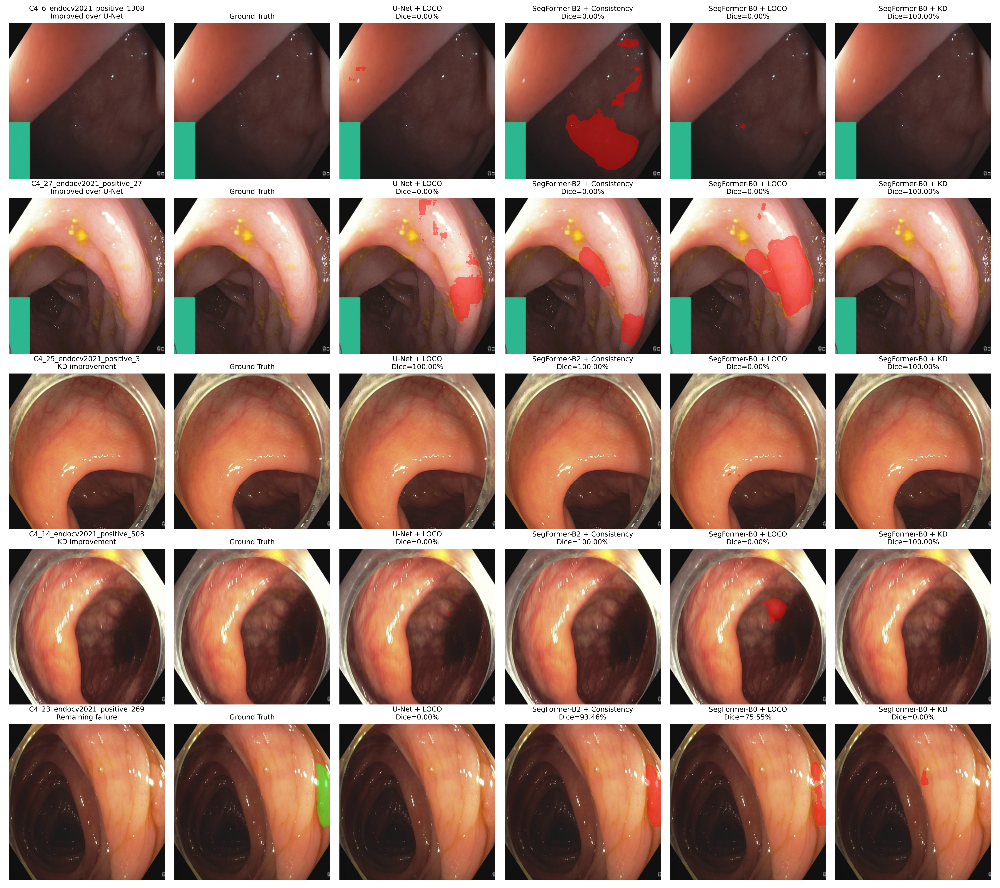

# PolypDG-Lite

### A deployment-oriented approach for cross-center colonoscopic polyp segmentation via domain generalization and low-power knowledge distillation

[](https://polypdg-lite-research.fjff.chatgpt.site)
[](https://doi.org/10.1038/s41597-023-01981-y)
[](#evaluation-protocol)

**Shih-Wei Fan Chiang**<sup>1</sup>, **Yen-Chiang Chang**<sup>1,2</sup>  
<sup>1</sup> Department of Medical Informatics, Chung Shan Medical University  
<sup>2</sup> Department of Medical Imaging, Chung Shan Medical University Hospital

PolypDG-Lite is a four-stage framework for robust colonoscopic polyp segmentation under cross-center domain shift. It combines a strict leave-one-center-out (LOCO) protocol, consistency-trained SegFormer-B2 teachers, knowledge distillation into compact students, and FP16 low-power deployment validation.

## Key results

| Configuration | Mean Dice | Mean IoU | C4 Dice | Parameters | FPS | Peak VRAM |
|---|---:|---:|---:|---:|---:|---:|
| U-Net + LOCO | 63.40% | - | 43.45% | - | - | - |
| SegFormer-B2 + Consistency | **79.61%** | **73.38%** | **66.13%** | 27.35M | 31.44 | 422.35 MB |
| SegFormer-B0 + KD (FP32) | 77.05% | 70.38% | 60.44% | **3.71M** | 87.05 | 125.64 MB |
| **SegFormer-B0 + KD (FP16)** | **77.05%** | **70.38%** | **60.44%** | **3.71M** | **95.26** | **55.43 MB** |

The final FP16 student has an estimated 7.08 MB parameter footprint, mean power draw of 14.77 W, and energy cost of 0.3818 J/frame. FLOPs were not reported in the verified experiment artifacts and are intentionally omitted.

## Framework

1. **Cross-center diagnosis** - establish a U-Net baseline under center-level LOCO.
2. **Robust teacher** - train SegFormer-B2 with prediction consistency across appearance-perturbed views.
3. **Lightweight distillation** - transfer teacher probability maps to DDRNet-23-slim, BiSeNetV2, and SegFormer-B0 students.
4. **Deployment validation** - re-evaluate the selected SegFormer-B0 + KD student under FP16 and profile speed, memory, power, and energy per frame.

## Evaluation protocol

Experiments use the clean, center-labeled subset of the [PolypGen](https://doi.org/10.1038/s41597-023-01981-y) dataset: **1,537 image-mask pairs from six clinical centers** (C1-C6). Each LOCO fold holds out one complete center as an unseen test domain; validation data comes only from the remaining training centers.

| Center | C1 | C2 | C3 | C4 | C5 | C6 | Total |
|---|---:|---:|---:|---:|---:|---:|---:|
| Images | 256 | 301 | 457 | 227 | 208 | 88 | **1,537** |

Results include region metrics (Dice, IoU), boundary metrics (HD95, ASSD), worst-center performance, and validation-to-test degradation. Machine-readable verified tables are in [`results/`](results/).

## Qualitative evidence

The following C4 cases compare the input, ground truth, U-Net baseline, robust teacher, undistilled student, and final distilled student. The selected set includes improvements as well as a remaining failure case to avoid cherry-picking only successful predictions.



## Code map

```text
research_code/
├── stage2/     # SegFormer-B2 consistency teacher
├── stage3/     # SegFormer-B0 knowledge-distilled student
├── stage4/     # FP16 re-evaluation, runtime, and power profiling
└── analysis/   # final tables and qualitative failure analysis
results/        # verified machine-readable paper results
app/            # responsive research showcase
```

The repository contains selected research scripts recovered from the experiment workspace. Local machine paths have been replaced with environment variables, but the full training pipeline still requires the PolypGen-derived LOCO directory layout and fold checkpoints described in [`research_code/README.md`](research_code/README.md).

## Environment

```bash
python -m venv .venv
# Windows: .venv\Scripts\activate
# Linux/macOS: source .venv/bin/activate
pip install -r requirements.txt
```

Set the dataset or experiment root before running a stage:

```bash
# Linux/macOS
export POLYPDG_DATA_ROOT=/path/to/experiment-root
export POLYPDG_LOCO_ROOT=/path/to/loco_1537_clean

# PowerShell
$env:POLYPDG_DATA_ROOT = "D:\path\to\experiment-root"
$env:POLYPDG_LOCO_ROOT = "D:\path\to\loco_1537_clean"
```

## Data and model weights

The PolypGen images, clinical-center data, and trained checkpoints are **not redistributed** in this repository. Obtain the dataset from its official source and follow its license and data-use terms. Model checkpoints will be released separately only after redistribution rights and release packaging are confirmed.

## Citation

```bibtex
@inproceedings{chiang2026polypdglite,
  title     = {PolypDG-Lite: A Deployment-Oriented Approach for Cross-Center Colonoscopic Polyp Segmentation via Domain Generalization and Low-Power Knowledge Distillation},
  author    = {Chiang, Shih-Wei Fan and Chang, Yen-Chiang},
  booktitle = {The 11th International Conference on Advanced Technology Innovation},
  year      = {2026}
}
```

## Responsible use

This repository is a research artifact, not a medical device. Predictions must not be used for diagnosis or patient care without appropriate clinical validation, regulatory review, and human oversight. No patient-identifiable information is included.
